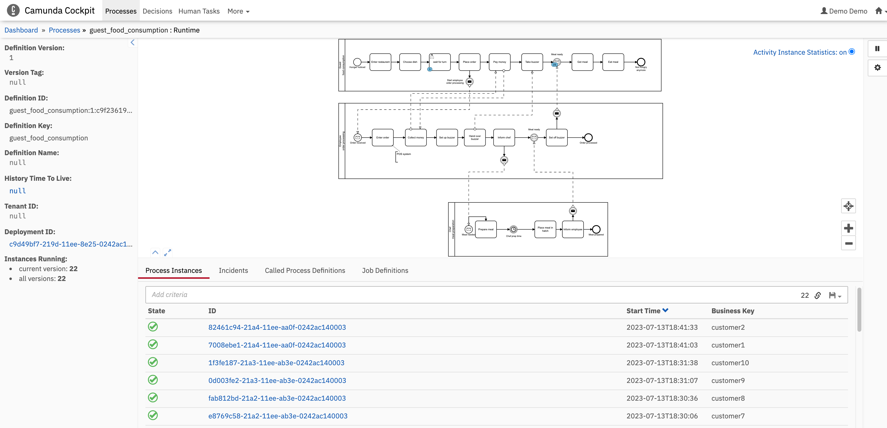

This is simple java springboot application to simulate Camunda workflow.
It doesn't do anything and only creates an instance of camunda application using
BPMN diagram src/main/resources/selfServiceRestaurant.bpmn

To build the application with maven: mvn -B package --file pom.xml

To start the application run: docker compose up
This step will do few things:
- start postgres instance on localport 5431 with database "workflow", user "camunda" and password "camunda"
- build docker container with camunda application and start it listening on localhost:8090
- run camunda-poker contaier which runs a shell script to generate some activity on camunda instance

You can see the progress in camunda cockpit by loggin in via web bwrowser

http://localhost:8090
user: demo
password: demo

http://localhost:8090/camunda/app/cockpit/default/#/processes

select one of the processess and see "customers" going through different steps of the BPMN process

This will generate records in the "workflow" Database which can be seen when connecting to postgres instance running on localhost:5431 with camunda/camunda DB: workflow.
workflow=# select count(*) from act_hi_actinst ;
 count 
-------
    29
(1 row)

the number of rows will be growing as more customers go through the system

